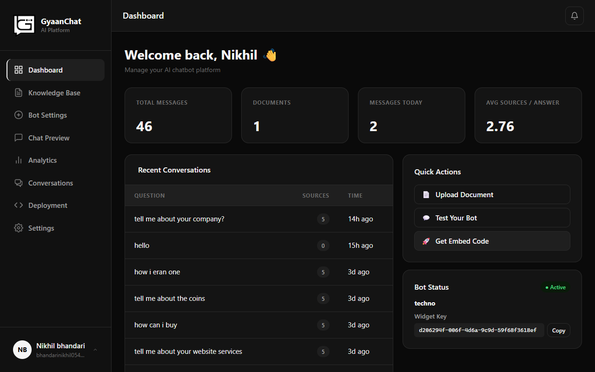
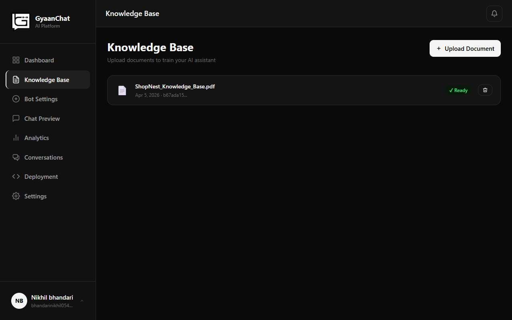
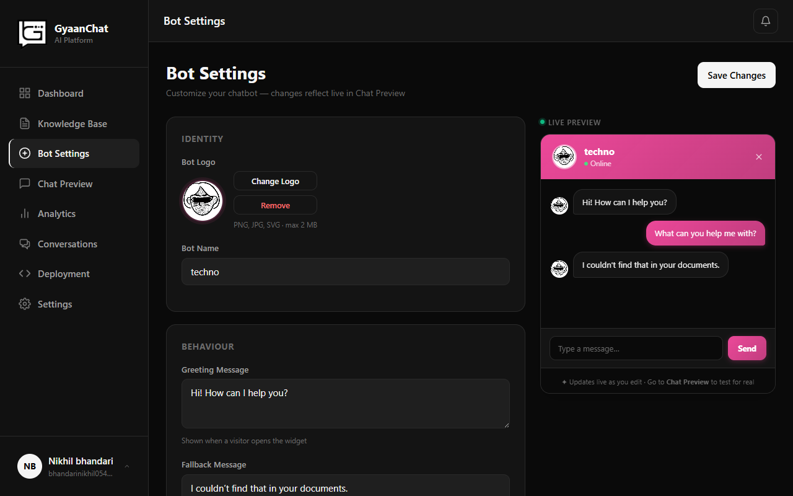
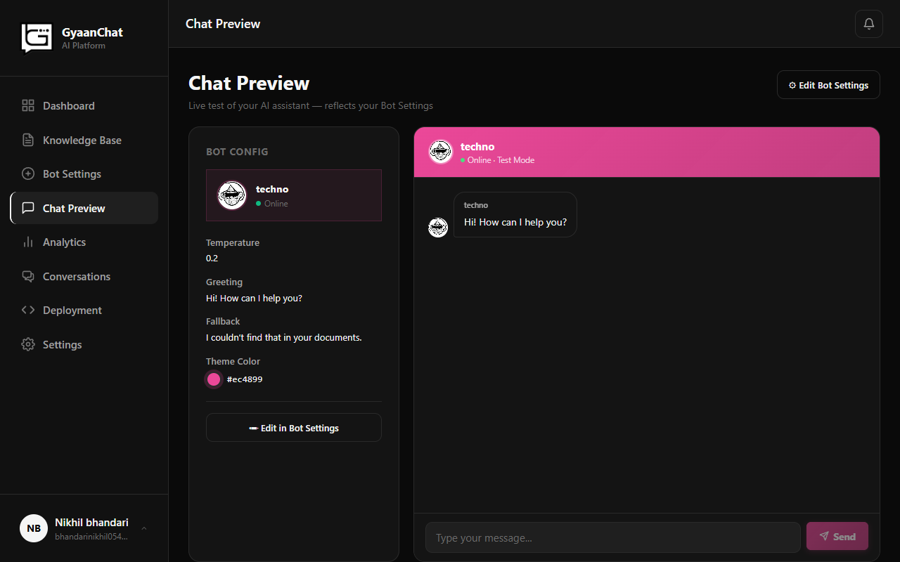
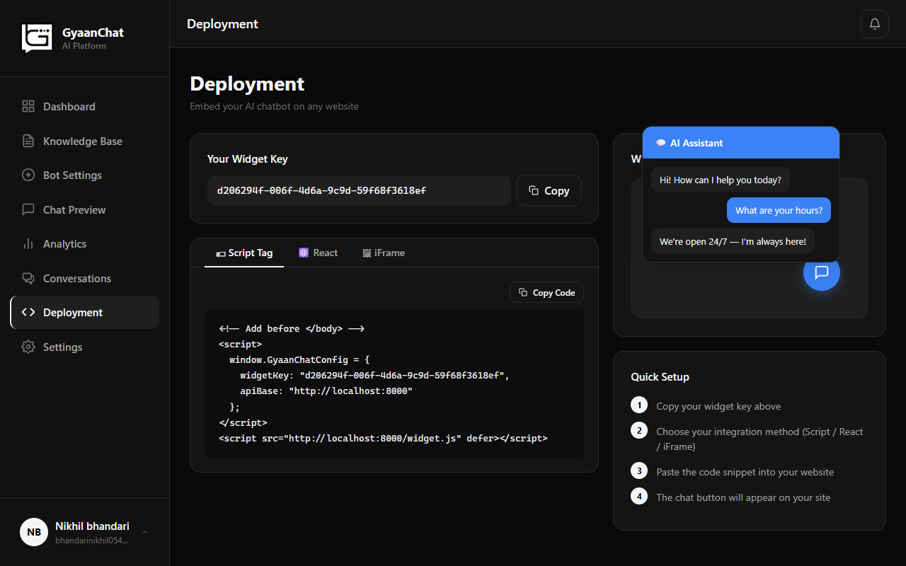

# GyaanChat AI 🚀

GyaanChat is an enterprise-ready, multi-tenant custom AI assistant builder. It enables organizations to create, customize, and deploy AI chatbots trained on their own documents and knowledge base (via Retrieval-Augmented Generation - RAG) without writing code.

---

## 📸 Screenshots & Showcase

<!-- SCREENSHOT_START -->
### Dashboard Overview
*Monitor chatbot analytics, total messages, and bot usage in real-time.*



### Knowledge Base
*Upload documents (PDF, Word, TXT) which are automatically chunked and embedded into ChromaDB.*



### Bot Customization
*Personalize the name, avatar, color palette, custom greetings, and model instructions.*



### Live Chat & Testing
*Interact with your custom bot in a sandbox environment before making it live.*



### Website Integration
*Copy-paste a single line of JavaScript code to embed the chatbot widget on any website.*



---

## 🛠️ Technology Stack

GyaanChat is split into three main components:

### Backend (FastAPI)
- **FastAPI**: High-performance Python web framework for handling API endpoints.
- **SQLAlchemy & PostgreSQL**: Robust database schema for multi-tenant users, bots, analytics, and chat logs.
- **ChromaDB**: High-performance vector database to store and search document chunk embeddings.
- **Sentence-Transformers**: Runs local text embedding generation model.
- **Ollama**: Local LLM orchestrator running models like `mistral` or `llama3`.
- **JWT Auth / Passlib**: Secure tokens and bcrypt password hashing.

### Frontend (React + TypeScript + Vite)
- **React 18** (TypeScript): Component-based premium UI framework.
- **Vite**: Rapid asset compilation and hot-reloading (HMR).
- **Lucide React**: Clean, modern iconography.
- **Context API**: Clean client-side state management for Auth, Theme, Toast notifications, and Settings.

### Infrastructure & Deployment
- **Docker Compose**: Pre-configured services for PostgreSQL, pgAdmin, and Ollama (with GPU hardware acceleration support).

---

## 📂 Project Structure

```text
Gyaan_ChatAI/
├── Backend/                 # FastAPI Python backend application
│   ├── app/
│   │   ├── api/             # API Router, endpoints & route handlers
│   │   ├── core/            # Database initialization and configurations
│   │   ├── models/          # SQLAlchemy Database Models
│   │   ├── schemas/         # Pydantic Schemas for validation
│   │   ├── services/        # Business Logic (RAG, Chunker, Embeddings, PDF parser)
│   │   └── static/          # Embedded chat widget script (widget.js)
│   ├── requirements.txt     # Python package dependencies
│   └── .env.example         # Environment template file
├── Frontend/
│   └── gyaanchat-frontend/  # React Vite Frontend application
│       ├── src/
│       │   ├── api/         # Axios client and endpoint configurations
│       │   ├── components/  # Layouts and reusable UI elements
│       │   ├── contexts/    # Context state providers (Auth, Theme, Toast)
│       │   └── pages/       # Page components (Dashboard, Bot Settings, Admin Panels)
│       └── .env.example     # Frontend API URL environment template
└── docker-compose.yml       # Docker Compose setup for PostgreSQL and Ollama
```

---

## ⚡ Setup & Installation

Follow these steps to set up GyaanChat locally:

### Prerequisites
- [Docker & Docker Compose](https://www.docker.com/)
- [Python 3.10+](https://www.python.org/downloads/)
- [Node.js v18+](https://nodejs.org/)

---

### Step 1: Start Infrastructure (Docker)
In the root directory of the project, run:
```bash
docker-compose up -d
```
This spins up:
- **PostgreSQL** on port `5432`
- **pgAdmin** (admin client) on port `5050`
- **Ollama** (local LLM runner) on port `11434`

#### Setup Ollama Model:
Wait for Ollama to start, then run this command to download the default RAG model (`mistral`):
```bash
docker exec -it gyaanchat_ollama ollama run mistral
```

---

### Step 2: Configure and Run Backend
1. Navigate to the `Backend` directory:
   ```bash
   cd Backend
   ```
2. Create your `.env` file from the example:
   ```bash
   cp .env.example .env
   ```
   *Edit the `.env` file to configure your secret keys and SMTP settings for Email OTP Verification.*

3. Create a virtual environment and activate it:
   ```bash
   python -m venv venv
   # On Windows:
   venv\Scripts\activate
   # On macOS/Linux:
   source venv/bin/activate
   ```
4. Install dependencies:
   ```bash
   pip install -r requirements.txt
   ```
5. Start the FastAPI development server:
   ```bash
   uvicorn app.main:app --reload --port 8000
   ```
   The backend API will now be active at: `http://localhost:8000`

---

### Step 3: Configure and Run Frontend
1. Navigate to the `Frontend/gyaanchat-frontend` directory:
   ```bash
   cd Frontend/gyaanchat-frontend
   ```
2. Create your `.env` file from the example:
   ```bash
   cp .env.example .env
   ```
3. Install the dependencies:
   ```bash
   npm install
   ```
4. Run the Vite development server:
   ```bash
   npm run dev
   ```
   The frontend application will now be running at: `http://localhost:5173`

---

## 🌐 How the Widget Embed Works

Once admins configure their bot, they can inject the widget onto any external site by including the following script tag before the closing `</body>` tag:

```html
<script 
  src="http://localhost:8000/static/widget.js" 
  data-bot-id="YOUR_BOT_ID" 
  async>
</script>
```

This script dynamic injects a responsive chat interface that connects securely back to the GyaanChat backend endpoints to stream replies.

---

## 🛡️ License

This project is licensed under the MIT License.
